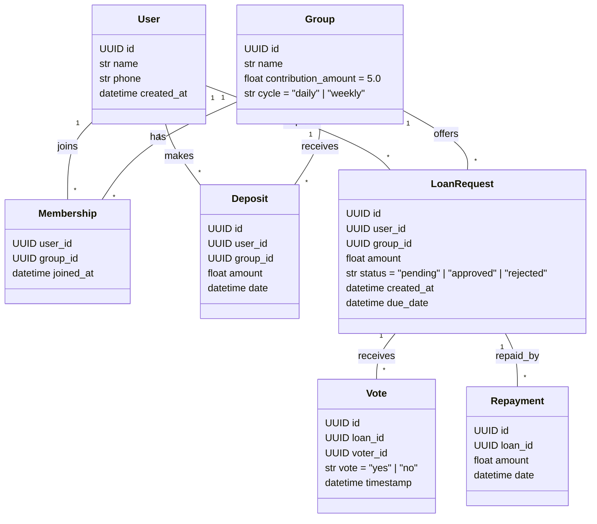

📄 Design Document: Community Lending Circle (Admin-less)
✨ Project Overview
Goal:
Build a simple, self-managed banking system where a group of people contribute ₹5 regularly, and anyone can request a loan. There is no admin — loan approvals are done by member voting. The entire application is deployed as a unified FastAPI app, serving both backend and frontend.

🎯 Key Features
Feature	Description
Member Registration	OTP-less email/phone login (simplified)
Group Participation	Each member is part of one or more lending circles
Regular Contribution	₹5 (configurable) per cycle (daily/weekly)
Loan Request	Any member can request a loan
Voting Mechanism	Loan approved only if majority of active members vote "Yes"
Loan Disbursal	Funds are "marked as given" — real money handled offline or through UPI
Repayment Tracking	Track repayments and due dates
Unified App	FastAPI serves both backend and static frontend

## Architecture

```mermaid
flowchart TD
    A[Frontend (Static HTML/JS)]
    B[FastAPI Server\n- User API\n- Group & Loan APIs\n- Voting Logic\n- Serves static files]
    C[PostgreSQL DB\nTables: users, groups, deposits, loans, votes]
    A -->|served from FastAPI| B --> C
```

🏗 Architecture
+---------------------------+
|   Frontend (Static HTML) |
|   React or Vanilla JS    |
+------------+--------------+
             |
             | (served from FastAPI)
             ↓
+------------+--------------+
|     FastAPI Server        |
|   - User API              |
|   - Group & Loan APIs     |
|   - Voting Logic          |
|   - Serves static files   |
+------------+--------------+
             |
             ↓
+---------------------------+
|       PostgreSQL DB       |
| Tables: users, groups,    |
| deposits, loans, votes    |
+---------------------------+
## Data Models



🧩 Data Models
1. User
python
Copy
Edit
id: UUID
name: str
phone: str
created_at: datetime
2. Group
python
Copy
Edit
id: UUID
name: str
contribution_amount: float = 5.0
cycle: str = "daily" | "weekly"
3. Membership
python
Copy
Edit
user_id: UUID
group_id: UUID
joined_at: datetime
4. Deposit
python
Copy
Edit
id: UUID
user_id: UUID
group_id: UUID
amount: float
date: datetime
5. LoanRequest
python
Copy
Edit
id: UUID
user_id: UUID
group_id: UUID
amount: float
status: "pending" | "approved" | "rejected"
created_at: datetime
due_date: datetime
6. Vote
python
Copy
Edit
id: UUID
loan_id: UUID
voter_id: UUID
vote: "yes" | "no"
timestamp: datetime
7. Repayment
python
Copy
Edit
id: UUID
loan_id: UUID
amount: float
date: datetime
📜 API Endpoints
🔐 Auth
POST /signup: Register a new user

GET /me: Get current user info

👥 Group
GET /groups: List available groups

POST /groups/join: Join group

GET /groups/{id}: Get group details

💸 Deposit
POST /deposit: Submit ₹5 deposit

GET /deposit/history: View deposit history

💰 Loan
POST /loan/request: Request a loan

GET /loan/{id}: View loan details

POST /loan/{id}/vote: Vote on loan request

POST /loan/{id}/repay: Repay loan

🗳 Voting Logic
When a loan is requested:

Status = "pending"

Voting window opens (24 hours)

Any group member can vote:

Vote must be either "yes" or "no"

If >50% of total group members vote "yes":

Status = "approved"

Disbursal is recorded (manual)

If time runs out or majority vote "no":

Status = "rejected"

🖼 Frontend
Hosted via StaticFiles in FastAPI

Could be:

React (build/ folder served via FastAPI)

Vanilla HTML/JS

Simple pages:

Join Group

Deposit

Loan Request

Voting Dashboard

Repayment Tracker

🐳 Deployment Plan
Serve on Render / Railway / Fly.io

Single Docker container with:

FastAPI

Postgres connection

Static frontend assets

⚠️ Limitations & Assumptions
No real money transfer — assumes members use UPI offline

Voting is not anonymous

No admin override

Simple loan logic — no credit scoring or penalties

🔮 Future Enhancements
Feature	Description
Payment Gateway	Integrate Razorpay or UPI for actual deposits/repayments
Notifications	Email or WhatsApp alerts on votes and due dates
Dispute Handling	Allow flags or disputes for bad actors
Reputation Score	Based on repayment history
Multigroup Support	Allow one user to join multiple circles

Would you like me to generate:

A boilerplate FastAPI + static frontend project structure?

SQL schema or Alembic migrations?

Dockerfile + deploy instructions?

Let me know how you’d like to move forward.