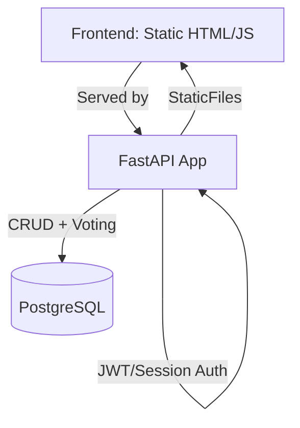
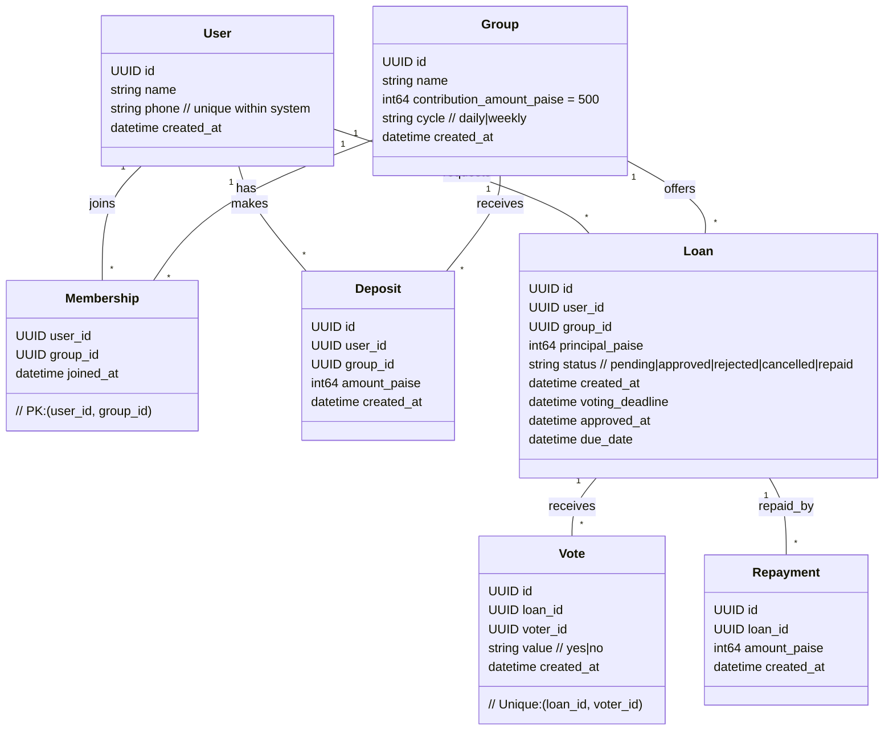
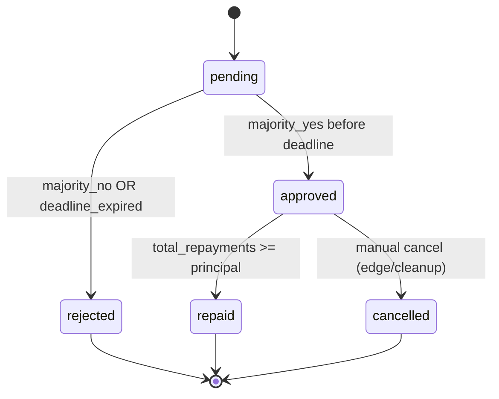

# 📄 Design Document: CircleFund – Admin‑less Community Lending Circle

Status: Draft v2 • Owner: You • Last updated: <fill on edit>

## ✨ Overview
**Goal**: A self‑managed lending circle where members contribute a small fixed amount each cycle (default ₹5) and can request loans. There is no admin; approvals are by member voting. The app is a single deployable service that serves both APIs and static frontend.

**In scope**:
- Registration, joining groups, deposits, loan requests, voting, disbursal recording, repayments, history views
- Simple governance: majority voting, no admin override

**Out of scope (for v1)**:
- Real money movement (UPI/payment gateway)
- Anonymous voting, complex credit models, penalties/interest

## 👥 Personas & Primary Use Cases
- Member: joins a group, deposits ₹5 per cycle, requests a loan, votes on others’ loans, repays
- Group Creator: creates a circle and invites members (no special powers beyond create)
- Auditor (implicit): any member can audit via history and balances

## ✅ Functional Requirements
- FR1: User registration and login without OTP (lightweight auth)
- FR2: Create/join a group; a user may belong to multiple groups (optional toggle)
- FR3: Record periodic deposits of a fixed, configurable amount per group
- FR4: Request a loan with amount and auto‑computed due date
- FR5: Voting window opens on request and closes after a fixed duration
- FR6: Exactly one vote per member per loan; change vote allowed until window closes
- FR7: Approval rule: strict majority of eligible voters = floor(N/2)+1 yes votes
- FR8: Loan disbursal recorded upon approval (funds handled offline)
- FR9: Repayments recorded; allow partial repayments; mark fully repaid when sum(repayments) ≥ principal
- FR10: Show per‑group treasury balance and member histories

## 🔒 Non‑Functional Requirements
- NFR1: Amount precision uses integer minor units (paise) to avoid float errors
- NFR2: Idempotency for POST operations using `Idempotency-Key`
- NFR3: Pagination for list endpoints; stable sorting
- NFR4: Basic rate limiting per IP/user
- NFR5: Data retention/export: members can download CSV of their activity
- NFR6: Timezone: all timestamps in UTC; display local time in UI

## 📚 Domain Glossary
- Treasury balance: sum(deposits) − sum(approved_disbursals) + sum(repayments)
- Eligible voters: current members of the group at request creation time (frozen set)
- Majority: > 50% of eligible voters voting Yes

## 🏗️ System Architecture


Components
- FastAPI service: authentication, groups, deposits, loans, votes, repayments; serves static assets
- Database: PostgreSQL (dev can use SQLite); future‑proof schemas for constraints and indexing
- Static frontend: vanilla HTML/JS (can be replaced by React later)

## 🗄️ Data Model Principles
- Monetary values stored as `BIGINT` in paise; convert to ₹ only at display time
- Use UUIDv4 as primary keys for all entities
- Add explicit unique and foreign key constraints; add indexes for frequent queries

## 📦 Entities (ER)


Indexes & Constraints (key examples)
- `user.phone` unique
- `membership (user_id, group_id)` primary key
- `vote (loan_id, voter_id)` unique to prevent double voting
- Foreign keys on all relations with `ON DELETE RESTRICT` except `Repayment.loan_id` (`CASCADE`)

## 🔁 Loan Lifecycle


## 🗳 Voting Rules
- Voting window: default 24h from request; configurable per group
- Eligible voters snapshot at request creation; later joinees cannot vote
- Majority threshold: `required_yes = floor(eligible/2)+1`
- Early termination: approve/reject as soon as outcome is mathematically certain
- Change vote allowed until deadline; last vote counts
- Exactly one vote per (loan, voter); enforced by unique constraint

## 💰 Treasury & Limits
- Treasury balance per group is derived; cannot go negative
- Optional rule (recommended): do not approve if `principal > treasury_balance`
- Optional per‑member loan caps and simultaneous active loans limit (v2)

## ⏱️ Scheduling & Time
- All timestamps are UTC; frontend localizes
- A background scheduler checks pending loans and finalizes at deadline

## 🔌 API Design
Conventions
- JSON over HTTP; snake_case keys
- Authentication: Bearer token (JWT) or signed session cookie (choose one)
- Idempotency: clients send `Idempotency-Key` for POST actions creating records
- Pagination: `?page`, `?page_size` (defaults 1, 20; max 100)
- Error model:
```json
{
  "error": {
    "code": "validation_error",
    "message": "...",
    "details": {"field": "..."}
  }
}
```

Endpoints (v1)
- Auth
  - POST `/signup` → 201 { user, token }
  - GET `/me` → 200 { user }
- Groups
  - GET `/groups` → list groups
  - POST `/groups` → create group
  - POST `/groups/{group_id}/join` → join
  - GET `/groups/{group_id}` → group details + treasury
- Deposits
  - POST `/groups/{group_id}/deposits` { amount_paise? } → record deposit (default: group contribution amount)
  - GET `/groups/{group_id}/deposits?user_id=&page=&page_size=`
- Loans
  - POST `/groups/{group_id}/loans` { principal_paise, due_date? } → create pending loan
  - GET `/loans/{loan_id}` → details inc. votes
  - POST `/loans/{loan_id}/votes` { value: "yes"|"no" } → cast/change vote
  - POST `/loans/{loan_id}/disbursal` { disbursed_at? } → mark disbursed on approval
  - POST `/loans/{loan_id}/repayments` { amount_paise } → add repayment

Minimal request/response examples will be fleshed out during API spec finalization.

## 🖥️ Frontend UX (v1)
Information Architecture
- Home → Login/Signup
- Groups → List, Create, Join
- Group Detail → Treasury, Members, Deposits
- Loans → Request, My Requests, Voting Dashboard
- Repayments → Tracker & history

UX Principles
- Single action per screen, clear statuses, optimistic UI for vote change
- Accessible forms (labels, error text); mobile‑first layout

## 🔐 Security & Privacy
- Store only minimal PII (name, phone)
- Hash tokens; do not log secrets, phone numbers in plaintext logs
- Rate limiting per user/IP; account lockout after excessive failures
- Authorization checks: user must be a member to access a group’s resources
- Audit trail: append‑only logs for critical events (loan created, vote cast, status changed)

## ⚙️ Operations & DevEx
Environment Variables
- `DATABASE_URL` (PostgreSQL)
- `JWT_SECRET` or `SESSION_SECRET`
- `VOTING_WINDOW_HOURS` default 24
- `DEFAULT_CONTRIBUTION_PAISE` default 500
- `RATE_LIMIT_RPM` default 60

Migrations & Data
- Use Alembic migrations; seed script for demo data
- Backups daily; retention 7–30 days (environment dependent)

Observability
- Structured logs (JSON); correlation id per request
- Metrics: request count/latency, approvals, rejections, pending loans, scheduler runs
- SLO: 99.5% availability; p95 API latency < 300ms on core endpoints

## 🧪 Testing Strategy
- Unit: domain rules (voting, treasury, lifecycle)
- Integration: API contracts, idempotency, pagination
- E2E: happy paths for join/deposit/request/vote/repay
- Property tests for monetary arithmetic using integers

## ⚠️ Risks & Mitigations
- Float rounding errors → use integer minor units
- Vote brigading by late joinees → snapshot eligible voters at creation
- Insufficient treasury → block approval if balance would go negative
- Long‑running pending loans → scheduler finalizes on deadline

## 🔮 Future Enhancements
- Payment gateway (UPI/Razorpay)
- Notifications (Email/WhatsApp) for votes and due dates
- Reputation/score and penalties/interest
- Multi‑group membership (toggleable) and cross‑group dashboards
- Anonymous voting and quadratic voting experiments

## ❓ Open Questions
- Auth flavor: JWT vs session cookie?
- Should we allow creating multiple loans per user concurrently?
- Exact deposit frequency enforcement (soft vs hard)?

---
This document intentionally precedes implementation. All code will be aligned to this spec post‑review.